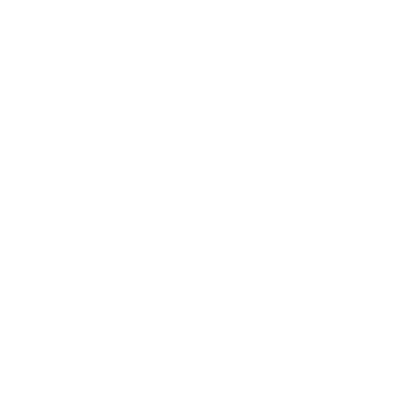

  

# 👻 kvba-scp
kvba-scp is a [Next.js](https://nextjs.org) project under a website [scp.kuba.lol](https://scp.kuba.lol) (as of time of writing) about SCP anomalies and it's entries. There's not much here but enough for a start.

Bootstrapped with [`create-next-app`](https://nextjs.org/docs/app/api-reference/cli/create-next-app).

##  🔧 Development

Project uses `pnpm` package manager to manage dependencies so for full support you need to install `pnpm` (`npm i -g pnpm`). To run the development server use:

```bash
pnpm dev
```

Open [http://localhost:3000](http://localhost:3000) with your browser to see the result.  
If you have any suggestions or pull request, I'm open for all of them.  
All the code is available under `src` directory.

#  🎨 Other

### Used Packages
- [react-powerglitch by 7PH](https://github.com/7PH/react-powerglitch) - Wrapper of glitch effect package for react. ([Original](https://github.com/7PH/powerglitch))
- [react-markdown by remarkjs](https://github.com/remarkjs/react-markdown) - Markdown renderer.
- [react-md-editor by uiwjs](https://github.com/uiwjs/react-md-editor) - Markdown editor.

### More Technical Info

This project uses [`next/font`](https://nextjs.org/docs/app/building-your-application/optimizing/fonts) to automatically optimize and load [Geist](https://vercel.com/font), a new font family for Vercel.  

For more information about framework this site uses see [next.js docs](https://nextjs.org/docs/).  

<sub>Why did I not change most of stuff here from default README? Because I don't need to, lol.</sub>